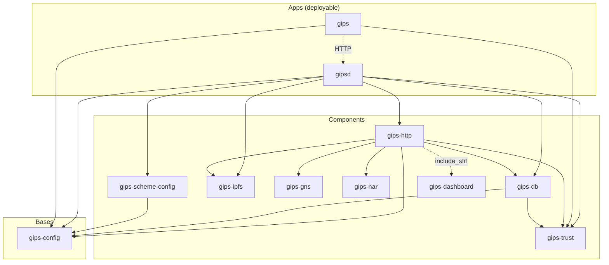
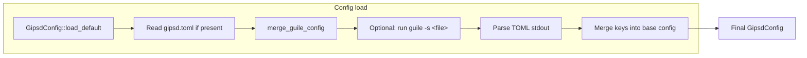
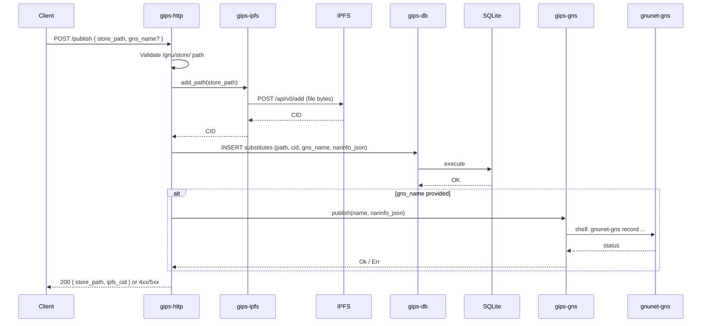
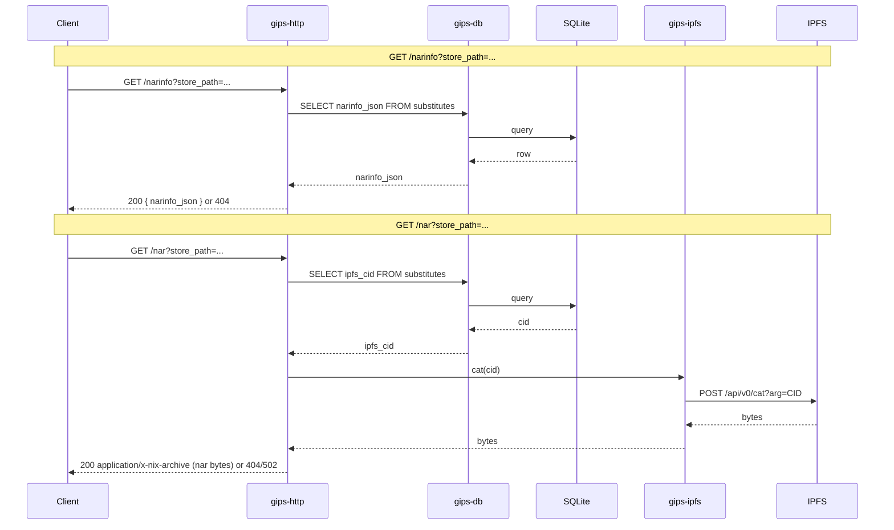
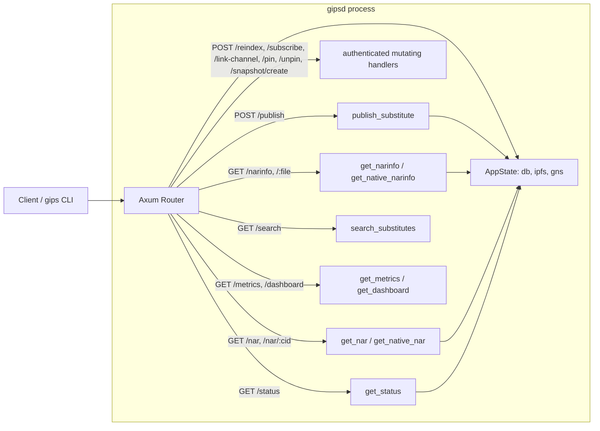

# GIPS architecture

<!-- markdownlint-disable MD013 -->

This document describes how the GIPS codebase and runtime are structured, using Mermaid diagrams.

## Workspace and crate dependencies

The repository follows a Polylith-style layout: bases have no internal workspace deps; components depend only on bases (and optionally other components); the daemon and CLI are thin apps that wire components together.

- **gips** talks to **gipsd** over HTTP; it depends on **gips-config** and **gips-trust** only for config paths and local key management (`gips key generate-guix`/`export-guix`), never on the daemon's serving stack.
- **gipsd** depends on **gips-config**, **gips-db**, **gips-http**, **gips-scheme-config**, **gips-ipfs**, and **gips-trust**.
- **gips-http** composes **gips-db**, **gips-ipfs**, **gips-gns**, **gips-nar**, and **gips-trust** for request handling, nar serialization/hashing, and signature verification, and compiles in the **gips-dashboard** page.
- **gips-trust** is the cryptographic verification core. The HTTP layer defaults to fail-closed, rejecting all unsigned content unless a publisher key matches the GNS name or `allow_unsigned` is explicitly enabled.

## Configuration loading

At startup, the daemon builds a single config by merging Rust defaults with an optional Guile-generated TOML overlay.

- Base config comes from Rust defaults and, if present, `~/.config/gips/gipsd.toml`. Paths are never resolved relative to the current working directory; if no config directory can be determined, the daemon exits rather than guessing.
- If `guile_config` is set, the Scheme file is executed; its stdout must be a TOML fragment. Only keys present in that TOML override the base (including the `[trust]` and `[guix_signing]` tables); all other fields are unchanged.
- The guile config path is fail-closed: a script that fails, hangs past its timeout, prints malformed TOML, or emits a malformed `[guix_signing]` table prevents startup instead of silently reverting to defaults.

## Publish flow (store path → IPFS + DB + GNS)

When a client calls `POST /publish` with a store path (and optional GNS name), the daemon validates the path, adds the file to IPFS, records the mapping in SQLite, and optionally publishes a GNS record.

- Path validation ensures the path is under `/gnu/store/` and contains no `..` segments.
- If GNS publication is requested and the external command fails, the HTTP response is 502 Bad Gateway.

### Security & Trust Model

GIPS operates a decentralized, fail-closed trust model for content ingestion:

- **Trust Configuration & Roots**: Users configure root trusted publishers with their public keys and GNS names.
- **Transitive Web of Trust & Capability Delegation**: Intermediary nodes mint attenuable UCAN delegation tokens (`VouchToken`) specifying maximum depth, stake scores, store path prefixes, and expirations. Transitive trust evaluation applies a 15% stake decay per hop.
- **Objective Cryptographic Fraud Proofs**: When an invalid `NarHash` or conflicting feed signature (equivocation) is detected, an objective, self-contained fraud proof is verified and recorded into SQLite, instantly severing trust and blacklisting the offending publisher across the network.
- **Automated PubSub Gossip**: Background workers subscribe to IPFS topics `gips.vouch.v1` and `gips.fraud.v1`, gossiping new vouches and fraud proofs across the federation in real time.
- **Fail-Closed Default**: Any `/narinfo` or `/:file` substitute retrieved from the IPFS backend is strictly verified against the publisher's signature and trust score. If the signature is invalid, missing, untrusted, or revoked by a fraud proof, the payload is rejected and the client receives a 404/500 error.
- **Integrity Guarantee**: Once a substitute is verified, its `NarHash` and `artifact_cid` are trusted to match the underlying content. Nar bytes are verified against the signed `NarHash` while streaming, and the final chunk is held back until the hash matches.
- **Serve-Time Guix-Native Signing**: When a `[guix_signing]` block is configured, `gipsd` signs each served narinfo in stock-Guix format (libgcrypt ECDSA with RFC 6979 nonces over the Ed25519 curve, via a `guile` subprocess), with a bounded in-memory signature cache. An unmodified `guix` verifies these signatures against its ACL after a one-time `guix archive --authorize`.

## Narinfo and nar retrieval

Guix (or any client) can query narinfo metadata and then fetch the nar bytes. The daemon looks up the store path in SQLite and, for the nar, fetches content from IPFS.

Endpoints:

- `/narinfo?store_path=<path>`: Returns substitute metadata (JSON). Fails closed (rejects data) if the signature is invalid or not from a trusted publisher, unless explicitly configured to allow unsigned.
- `/:file`: Catch-all endpoint for returning native Guix `.narinfo` files from IPFS, verified against trusted publishers.
- `/nar?store_path=<path>`: Redirects to or streams the raw binary output.
- `/nar/:cid`: Returns native Guix `.nar` files from IPFS.
- `/snapshot/create`: Internal endpoint for freezing a store path's dependencies into a snapshot manifest (requires authentication/local access).
- `/search?q=<query>`: Full-text search over the local substitute index.
- `/reindex` (POST, authenticated): Backfills integrity metadata for legacy DB rows.
- `/subscribe`, `/link-channel`, `/pin`, `/unpin` (POST, authenticated): Subscription and pin management.
- `/metrics` (authenticated) and `/dashboard`: JSON latency metrics (`gips.metrics.v1`), Prometheus text metrics (`--prometheus`), and the built-in telemetry dashboard.
- `/metrics/history` (GET, authenticated): Rolling latency metrics history persisted across restarts in SQLite.
- `/key/advertise` (POST, authenticated) and `/key/resolve` (GET): GNS key advertisement and discovery over TXT records.

- Narinfo is served from the stored JSON in the database.
- Nar bytes are streamed from IPFS via the daemon; the client does not talk to IPFS directly.

## High-level request routing

The HTTP layer routes requests to the appropriate handlers; shared state (DB, IPFS client, GNS client) is held in `AppState`.

All stateful handlers receive `AppState` via Axum’s `State` extractor and use it to access the database pool, IPFS client, and GNS client.

## Software Diversity & Implementation Agility

GIPS is designed with **Software Diversity** and **Implementation Agility** in mind to prevent monoculture vulnerabilities.

While the current reference implementation is written in Rust (using libraries like `reqwest` and `axum`), the GIPS network protocol (the JSON feeds, IPFS CID structures, and GNS records) is completely independent of the Rust runtime.

If a severe zero-day vulnerability is ever discovered in the Rust networking stack (e.g., a `reqwest` parser bug that can crash the node), operators should be able to hot-swap to an independent implementation of the GIPS daemon written in a different language (e.g., Go, Scheme, or Zig). We explicitly prefer **network-level diversity** (encouraging the community to build diverse node implementations) rather than trying to build complex, single-point-of-failure switching logic between different HTTP libraries inside a single binary.
